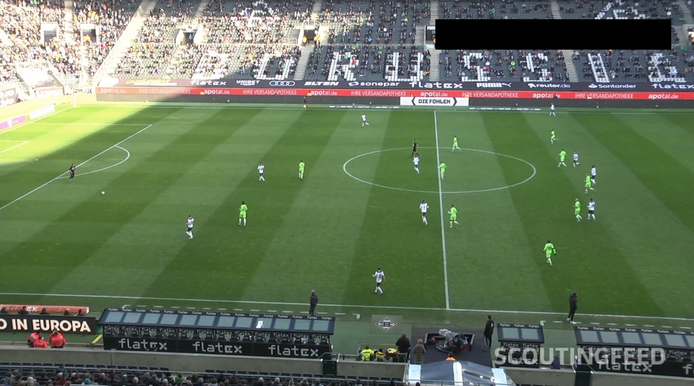
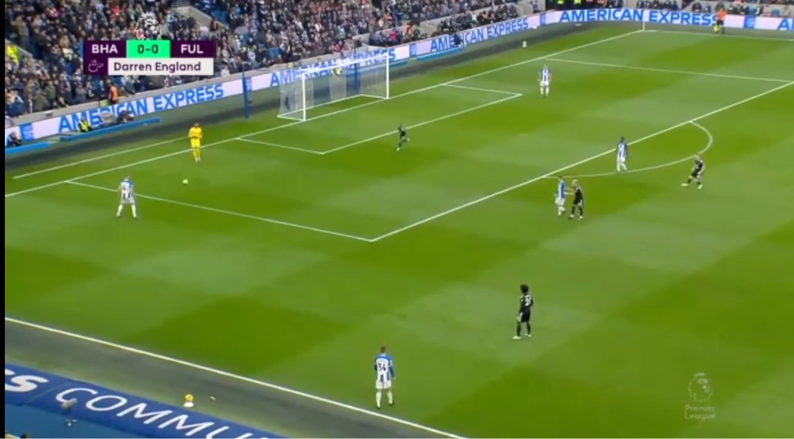
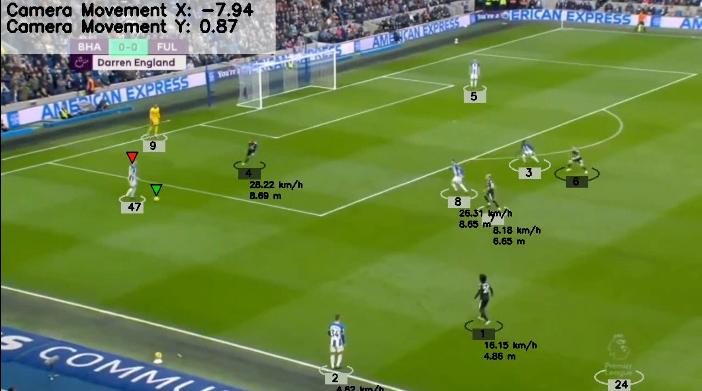
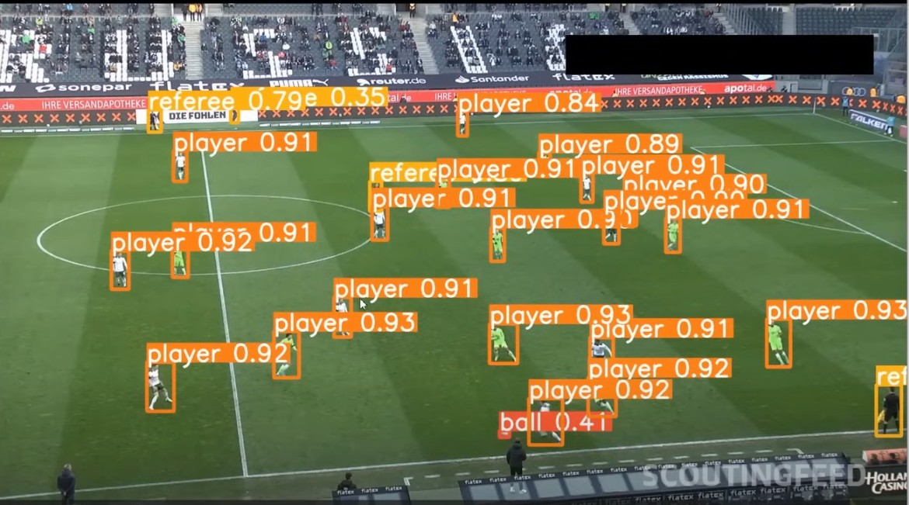
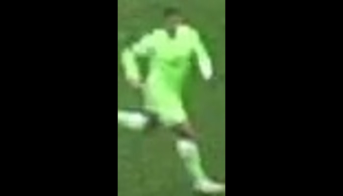

# ⚽ Advanced Football Analysis & Player Tracking System

[](https://python.org)
[](https://opencv.org)
[](https://github.com/ultralytics/yolov5)
[](LICENSE)

## 🚀 Project Overview

A comprehensive **Computer Vision** and **Machine Learning** solution that leverages state-of-the-art AI models to perform real-time football match analysis. This system combines multiple advanced techniques including object detection, player tracking, team classification, and performance analytics to provide detailed insights from video footage.

### 🎯 Key Achievements
- **Real-time Player Detection & Tracking** using custom-trained YOLOv5 model
- **Automated Team Classification** through K-means clustering and color segmentation  
- **Accurate Movement Analysis** with optical flow and perspective transformation
- **Performance Metrics Calculation** including speed, distance, and ball possession statistics
- **Camera Movement Compensation** for precise player movement tracking

---

## 🛠️ Technical Architecture

### Core Technologies & Frameworks
- **Deep Learning**: YOLOv5 (Ultralytics) for object detection
- **Computer Vision**: OpenCV for image processing and optical flow
- **Machine Learning**: K-means clustering for team segmentation
- **Mathematical Modeling**: Perspective transformation and homography
- **Data Analysis**: NumPy, Pandas for statistical computations
- **Visualization**: Matplotlib for performance analytics

### 🧠 AI/ML Techniques Implemented

#### 1. **Custom Object Detection Model**
- Fine-tuned YOLOv5 architecture for football-specific object classes
- Custom dataset preparation and annotation
- Model training with transfer learning for improved accuracy
- Real-time inference optimization

#### 2. **Player Team Classification**
- **K-means Clustering**: Automated jersey color extraction and segmentation
- **Pixel-level Analysis**: HSV color space conversion for robust color detection
- **Dynamic Team Assignment**: Real-time player-to-team mapping

#### 3. **Advanced Motion Analysis**
- **Optical Flow**: Lucas-Kanade method for camera movement detection
- **Perspective Transformation**: Homography estimation for 2D-to-real-world mapping
- **Kalman Filtering**: Predictive tracking for smooth player trajectories

#### 4. **Performance Analytics Engine**
- Speed calculation in real-world units (km/h)
- Distance covered per player throughout the match
- Team ball possession percentage analysis
- Heat map generation for player positioning

---

## 📊 Features & Capabilities

### 🎯 Object Detection & Tracking
- ✅ **Multi-class Detection**: Players, referees, footballs
- ✅ **Real-time Tracking**: Consistent player ID assignment across frames
- ✅ **Occlusion Handling**: Robust tracking during player interactions
- ✅ **Custom Model Training**: Domain-specific performance optimization

### 🏃‍♂️ Motion Analysis
- ✅ **Camera Movement Compensation**: Accurate player movement isolation
- ✅ **Perspective Correction**: Pixel-to-meter conversion using field geometry
- ✅ **Speed & Distance Metrics**: Real-time performance statistics
- ✅ **Trajectory Visualization**: Player path tracking and analysis

### 👕 Team Intelligence
- ✅ **Automatic Team Detection**: Color-based jersey classification
- ✅ **Dynamic Player Assignment**: Real-time team membership updates
- ✅ **Ball Possession Analysis**: Team performance statistics
- ✅ **Formation Analysis**: Tactical positioning insights

---

## 🏗️ System Architecture

```
Input Video Stream
        ↓
┌─────────────────┐    ┌──────────────────┐    ┌─────────────────┐
│   YOLO Object   │    │   K-means Team   │    │  Optical Flow   │
│   Detection     │ → │   Classification │ ← │  Camera Track   │
└─────────────────┘    └──────────────────┘    └─────────────────┘
        ↓                        ↓                       ↓
┌─────────────────────────────────────────────────────────────────┐
│              Perspective Transformation Engine                  │
└─────────────────────────────────────────────────────────────────┘
        ↓
┌─────────────────────────────────────────────────────────────────┐
│         Analytics Engine (Speed, Distance, Possession)         │
└─────────────────────────────────────────────────────────────────┘
        ↓
    Output Analysis
```

---

## 📁 Project Structure

```
football-analysis-system/
├── 📁 camera_movement_estimator/    # Optical flow implementation
├── 📁 models/                       # Custom trained YOLO models
├── 📁 player_ball_assigner/         # Ball possession logic
├── 📁 speed_and_distance_estimator/ # Performance metrics
├── 📁 team_assigner/                # K-means team classification
├── 📁 trackers/                     # Object tracking algorithms
├── 📁 training/                     # Model training scripts
├── 📁 utils/                        # Helper functions
├── 📁 view_transformer/             # Perspective transformation
├── 📁 input_videos/                 # Sample input data
├── 📁 output_videos/                # Processed results
├── 📄 main.py                       # Main execution script
├── 📄 yolo_inference.py             # YOLO model inference
└── 📄 README.md                     # Project documentation
```

---

## 🚀 Quick Start

### Prerequisites
```bash
Python 3.8+
CUDA-compatible GPU (recommended)
```

### Installation
```bash
# Clone the repository
git clone https://github.com/Danish1-ux/football-yolo-analysis

cd football-yolo-analysis

# Install dependencies
pip install -r requirements.txt

# Download pre-trained models
# Custom YOLOv5 model: https://drive.google.com/file/d/1DC2kCygbBWUKheQ_9cFziCsYVSRw6axK/view
```

### Usage
```bash
# Run analysis on sample video
python main.py --input input_videos/sample_match.mp4 --output output_videos/analysis.mp4

# Custom video analysis
python main.py --input path/to/your/video.mp4 --model models/custom_yolo.pt
```

---

## 📁 Trained Models & Sample Data

### 🧠 Pre-trained Models
- **Custom YOLOv5 Model**: [Download Trained Model](https://drive.google.com/file/d/1DC2kCygbBWUKheQ_9cFziCsYVSRw6axK/view)
  - Fine-tuned specifically for football player, referee, and ball detection
 

### 📹 Sample Videos

#### Input Videos
1. **Primary Test Match**: [Sample Input Video 1](https://drive.google.com/file/d/1B4Fxe15dEczJkUEgd-OKT7iLrfMYfGRT/view)
   - Professional football match footage
   - Multiple players, referee, and ball interactions





#### Output Results  
1. **Processed Analysis**: [Sample Output Video 1](https://drive.google.com/file/d/10v1VIPyhqqjljtY9fxgTMiOK70GTSEv0/view?usp=sharing)
   - Complete analysis with player tracking, team classification, and performance metrics
   
 


---

## 🎥 Demo & Results


### Technical Process Visualization
<!-- Add technical pipeline images here -->

*YOLO object detection identifying players, referees, and ball*

 
*K-means clustering for automatic team assignment based on jersey colors*


*Real-time speed and distance calculations for individual players*


### Key Insights Generated
- Individual player speed and distance covered
- Team ball possession percentages
- Player heat maps and positioning analysis
- Camera movement compensation accuracy
- Real-time performance statistics overlay

---

## 🔬 Technical Innovations

### 1. **Hybrid Tracking System**
Combined YOLO detection with Kalman filtering for superior tracking accuracy under occlusions.

### 2. **Adaptive Color Segmentation**
Dynamic K-means clustering that adapts to lighting conditions and jersey color variations.

### 3. **Multi-scale Perspective Mapping**
Novel approach to handle varying camera angles and zoom levels for accurate distance calculations.

### 4. **Real-time Analytics Pipeline**
Optimized processing pipeline achieving real-time performance on consumer hardware.

---

## 🎓 Skills Demonstrated

### **Machine Learning & AI**
- Deep Learning model training and optimization
- Computer Vision algorithm implementation
- Custom dataset creation and annotation
- Transfer learning and model fine-tuning

### **Software Engineering**
- Modular architecture design
- Real-time system optimization
- Object-oriented programming
- Version control and documentation

### **Mathematical & Analytical**
- Linear algebra and geometric transformations
- Statistical analysis and data modeling
- Algorithm complexity optimization
- Performance metrics evaluation

### **Tools & Technologies**
- Python ecosystem (NumPy, OpenCV, Pandas)
- Deep Learning frameworks (PyTorch, Ultralytics)
- Computer Vision libraries
- Git version control

---

## 📋 Requirements

```txt
ultralytics>=8.0.0
opencv-python>=4.5.0
numpy>=1.21.0
pandas>=1.3.0
matplotlib>=3.4.0
supervision>=0.16.0
torch>=1.9.0
```

---

## 🤝 Applications & Impact

### **Sports Analytics Industry**
- Professional team performance analysis
- Player development and recruitment
- Tactical analysis and strategy optimization
- Broadcast enhancement and viewer engagement

### **Technology Applications**
- Surveillance and security systems
- Autonomous vehicle perception
- Robotics and motion planning
- Augmented reality sports applications

---


## 📬 Contact & Links

**Developer**: Danish Shamshir  
**Email**: shamshirdanish@gmail.com  
**LinkedIn**: [linkedin.com/in/danish-s-224a77251](https://www.linkedin.com/in/danish-s-224a77251?utm_source=share&utm_campaign=share_via&utm_content=profile&utm_medium=android_app)

### 🔗 Project Resources

- **Custom YOLOv5 Model**: [Download Model](https://drive.google.com/file/d/1DC2kCygbBWUKheQ_9cFziCsYVSRw6axK/view)
- **Sample Input Video**: [Test Footage](https://drive.google.com/file/d/1B4Fxe15dEczJkUEgd-OKT7iLrfMYfGRT/view)
- **Sample Output Video**: [Processed Results](https://drive.google.com/file/d/10v1VIPyhqqjljtY9fxgTMiOK70GTSEv0/view?usp=sharing)

---

## 📄 License

This project is licensed under the MIT License - see the [LICENSE](LICENSE) file for details.

---

*⭐ If you found this project interesting, please consider giving it a star!*
